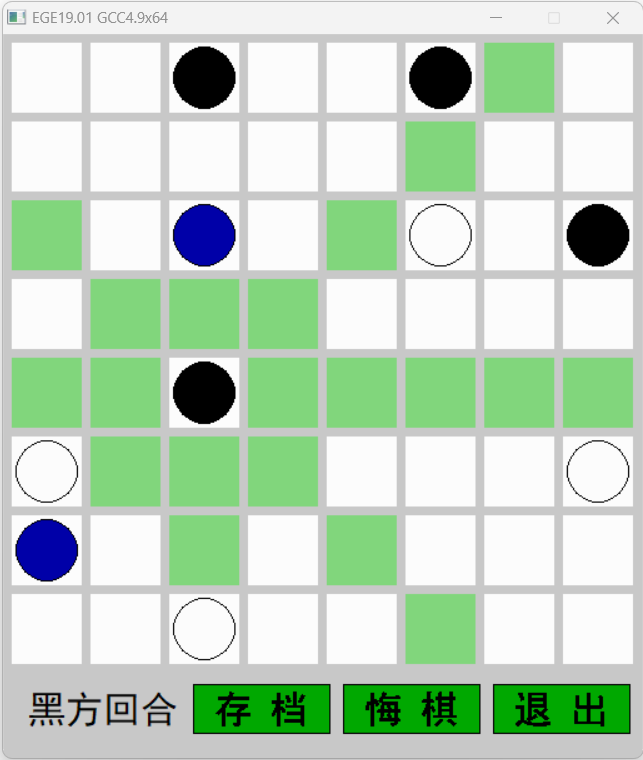

# Amazon-chess
Amazon chess game. Play against easy, normal and hard bots.

Rules: [Amazon (chess) - Wikipedia](https://en.wikipedia.org/wiki/Amazon_(chess)).

PKU Introduction to Computation (A) 19 Fall course project.

